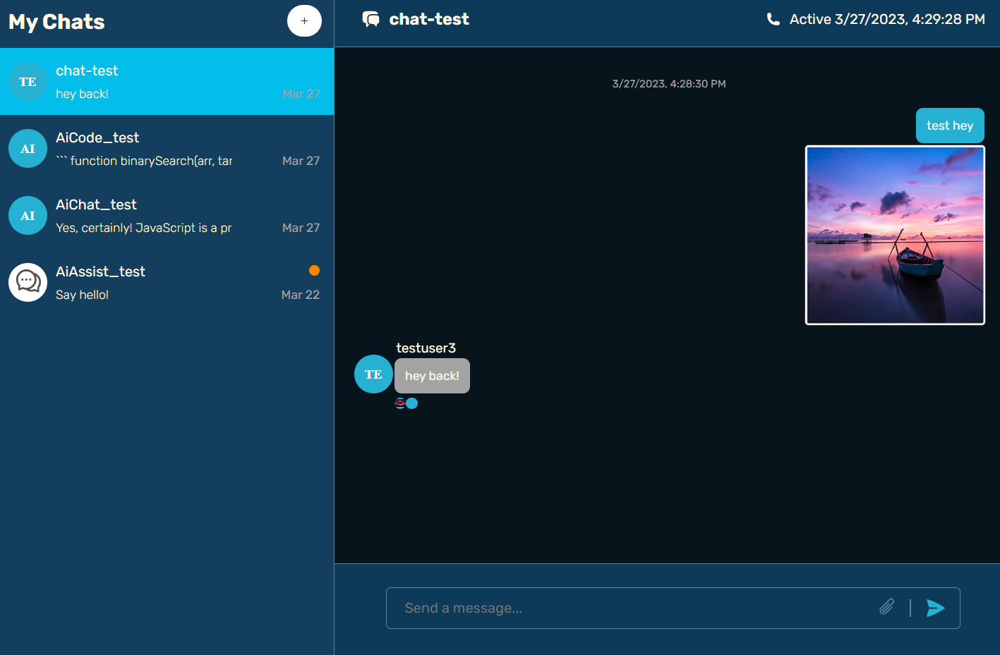

## ChatApp with ChatGPT integration

A responsive fullstack app made with ReactJs with Ts frontend and Express backend with the purpose of integrating the openai(chatgpt) features into a chatting application so that the user can ask questions/chat to the chatgpt ai and also chat with other users.

ChatEngine Advanced is used as both storage and chat logic and OpenAi's ChatGPT for ai integration.

Other technologies/libraries used:

- OpenAi library for api calls to ChatGPT
- Axios for backend api calls to both ChatEngine and OpenAi apis
- Sass for styling the app
- React-Dropzone for image upload
- React Router for page navigation
- Redux Toolkit Query for api calls to backend
- React Chat Engine Advanced

### App presentation

##### Login section

Simple login/register form.

##### Chat Window section

###### New user view

A new user can use the + icon from the left-top side to create a new chat.

The user can add members to the conversation or add the ai bot for assistance from the right side of the page.
The conversation can also be deleted by pressing the button 'Delete this chat'.

###### User chatting

How a conversation between users looks.

When sending an image the user gets a preview in the left side of the 'Send a message' section and he can also choose to delete the attached image.

###### Ai chatting

The user can create 3 types of chats:

1. AiChat that is classic chatting with the bot.
   
2. AiAssist which auto-completes the message window.
   
3. AiCode which only replies with code.
   

### What I learned?

In this project my focus was the experience of using Chat Engine Advanced which is a paid tool for creating chatting applicatios that makes implementation of chat features much easier, also having the option of component custom styling and providing storage for the messages.

I also learned how to integrate ChatGPT into a chatting application(both the old davinci 3 and the new gpt 3.5 turbo models) and how to make it provide different types of assitance to the users like replying only using code or auto-completions.

Practice styling with Sass.

How to use some of React Redux Toolkit Query features.

How to use Helmet and Morgan and how useful they are in the express server for security improvements and logs.

Practice using TypeScript with a more complex library such as chat engine advanced.

### What I could improve?

- The responsiveness for mobile
- Auth is very simple -> implement jwt
- Automatic Ai chats for users

### How to run ?

Frontend(client)

> npm run build or dev

Backend(client)

> npm run dev
